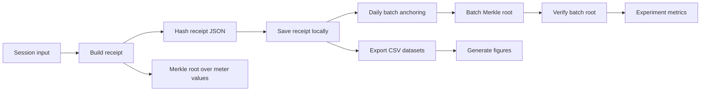

# Proof-of-Charge Backend

Proof-of-Charge is a Python MVP for verifiable EV charging receipts. It turns
charging session data into deterministic receipts, hashes those receipts,
groups them into daily Merkle batch anchors, verifies anchored batches, and
exports datasets and figures for research or thesis material.

The current implementation is local-first: receipts, indexes, anchors, exports,
and experiment results are written to files in this repository. Blockchain
transactions and IPFS CIDs are represented as placeholders for now.

## What It Does

- Finalizes EV charging sessions through a FastAPI endpoint.
- Builds deterministic receipt JSON with session metadata, pricing, settlement,
  meter values, and a Merkle root over the meter stream.
- Supports V2G-ready energy fields: `import_kwh`, `export_kwh`, and `net_kwh`.
- Supports `charge_only`, `discharge_only`, and `bidirectional` synthetic
  sessions.
- Stores local receipts under `receipts/`.
- Creates mock daily batch anchors from receipt hashes.
- Verifies that stored batch roots match recomputed Merkle roots.
- Exports CSV datasets and PNG figures under `exports/`.
- Runs reproducible synthetic experiments under `results/<run_id>/`.

## Project Structure

```text
src/
  main.py                FastAPI app and receipt finalization endpoint
  receipt_builder.py     Receipt schema, energy math, pricing, receipt hash
  merkle.py              Merkle tree helper
  storage.py             Local JSON receipt/index storage
  synthetic_sessions.py  Synthetic EV charging/V2G session generator
  batch_anchoring.py     Mock daily batch anchoring
  verifier.py            Single receipt verification
  verifier_batch.py      Daily batch root verification
  export.py              CSV export generation
  charts.py              Figure generation
  run_experiment.py      End-to-end reproducible experiment runner
  tamper.py              Tampering helper for verification demos
  audit_day.py           Day-level audit helper
  release_notes.py       Release notes generator from git history

receipts/                Local receipt JSON files, index, and mock anchors
exports/                 Latest exported CSVs and figures
results/                 Versioned experiment snapshots
samples/                 Optional sample inputs
```

## Current Pipeline



## Setup

Use a Python virtual environment. The repo currently does not include a pinned
dependency file, so install the runtime packages directly:

```bash
python3 -m venv .venv
source .venv/bin/activate
pip install fastapi uvicorn pydantic matplotlib
```

`matplotlib` is only needed for chart generation.

## Run The API

```bash
uvicorn src.main:app --reload
```

The API exposes:

```text
POST /v1/receipts/finalize
```

The endpoint accepts a charging session payload, builds a receipt, hashes it,
saves it under `receipts/`, and returns the receipt plus its hash.

## Generate Synthetic Sessions

Start the API first, then generate sessions:

```bash
python3 -m src.synthetic_sessions 10
```

Useful variants:

```bash
python3 -m src.synthetic_sessions 10 --session-type all
python3 -m src.synthetic_sessions 50 --session-type bidirectional
python3 -m src.synthetic_sessions 100 --bidirectional-ratio 0.30 --discharge-ratio 0.15
```

If an EVSE registry CSV is available:

```bash
python3 -m src.synthetic_sessions 100 --registry exports/evse_registry.csv
```

## Anchor Receipts

Anchor all available days:

```bash
python3 -m src.batch_anchoring
```

Anchor a specific day:

```bash
python3 -m src.batch_anchoring 2026-03-07
```

Anchor only one experiment/run prefix:

```bash
python3 -m src.batch_anchoring 2026-03-07 --prefix run_20260307_223049
```

Anchoring is currently mocked. It writes a batch root into `receipts/anchors.json`
and updates the local receipt index with `batch_root` and `batch_day`.

## Verify Receipts

Verify a single receipt:

```bash
python3 -m src.verifier <session_id>
```

Verify a daily batch:

```bash
python3 -m src.verifier_batch 2026-03-07
```

Verify a specific run prefix:

```bash
python3 -m src.verifier_batch 2026-03-07 --prefix run_20260307_223049
```

## Export Datasets And Figures

Generate CSV exports:

```bash
python3 -m src.export
```

Generate figures:

```bash
python3 -m src.charts
```

Main exported datasets:

- `exports/receipts.csv`
- `exports/sessions.csv`
- `exports/meter_values.csv`
- `exports/anchors.csv`
- `exports/verifications.csv`

Figures are written to `exports/figures/`. See `exports/README.md` for the
export-specific schema notes.

## Run A Reproducible Experiment

Use the experiment runner for the full local pipeline:

```bash
python3 -m src.run_experiment 100 --day 2026-03-07 --seed 42
```

This performs:

```text
generate sessions -> build receipts -> save receipts -> anchor day ->
verify batch -> export datasets -> generate figures -> snapshot results
```

Output is written to:

```text
results/<run_id>/
  manifest.json
  metrics.json
  datasets/*.csv
  figures/*
```

Example with explicit run ID:

```bash
python3 -m src.run_experiment 100 --day 2026-03-07 --seed 42 --run-id demo_100
```

## Tamper Demo

Modify a stored receipt to test verification behavior:

```bash
python3 -m src.tamper <session_id> 1.0
python3 -m src.verifier <session_id>
```

The expected result is that the recomputed hash no longer matches the stored
receipt hash.

## Current Limitations

- Storage is file-based JSON, not a database.
- Batch anchoring is local/mock only.
- `chain_tx` and `cid` are placeholders for future blockchain/IPFS integration.
- Synthetic sessions simulate charging behavior; there is no live OCPP charger
  integration yet.
- Dependencies are not pinned in `requirements.txt` or `pyproject.toml` yet.

## Useful Maintenance Commands

Generate release notes from git history:

```bash
python3 -m src.release_notes --max-count 200
```

Generate release notes for a ref range:

```bash
python3 -m src.release_notes --from-ref v0.1.0 --to-ref HEAD
```
