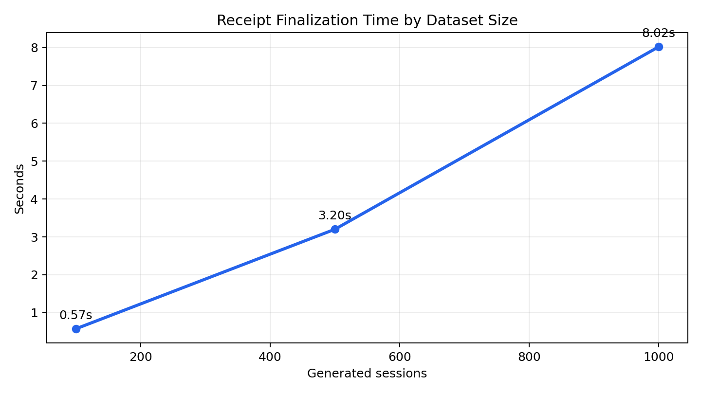
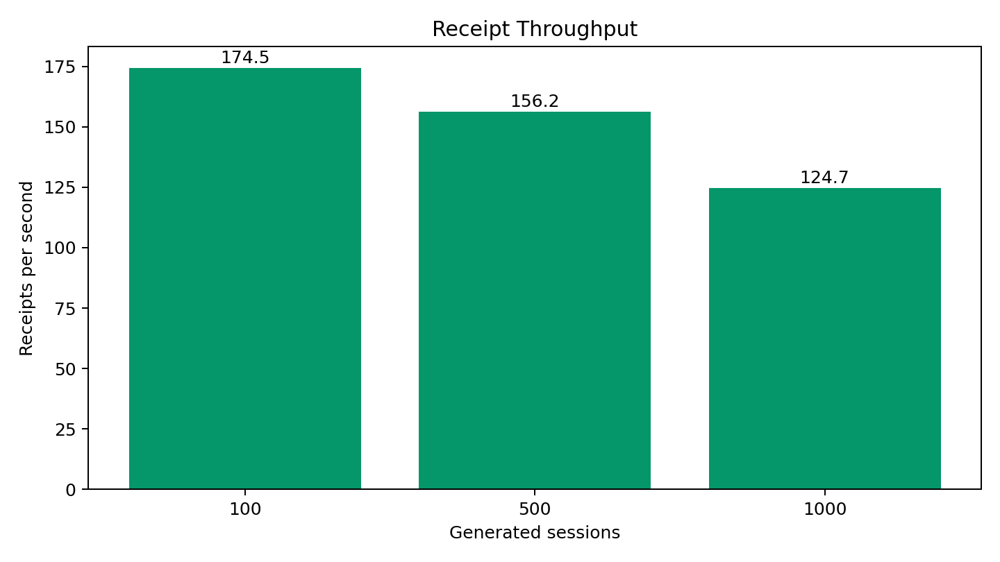
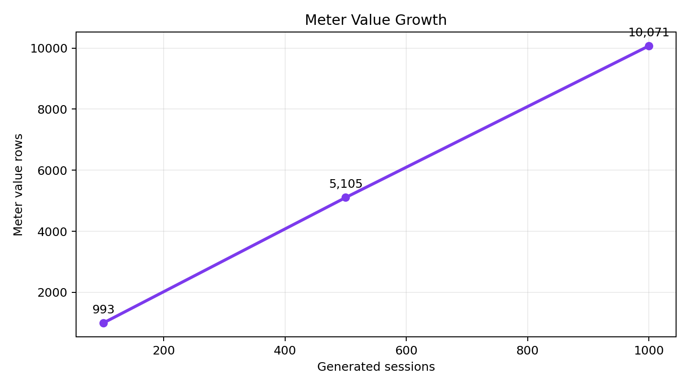
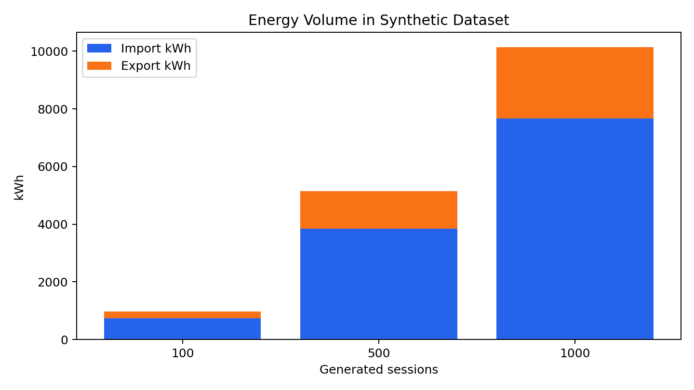

# Proof-of-Charge Research Results

**Generated:** 2026-05-21  
**Runs:** `100`, `500`, and `1000` synthetic EV charging sessions  
**Source:** `results/research_20260521_*` run folders

---

## Slide 1: Research Goal

**Goal:** evaluate whether EV charging sessions can be converted into tamper-evident receipts and scalable batch anchors.

Key idea:

```text
meter values -> receipt -> receipt hash -> batch Merkle root -> verification
```

---

## Slide 2: Experimental Setup

- Synthetic EV charging sessions were generated with fixed seed `42`.
- Runs used three dataset sizes: `100`, `500`, and `1000` sessions.
- Sessions include charge-only, discharge-only, and bidirectional behavior.
- Each run produced receipts, Merkle batch anchors, verification rows, datasets, and figures.
- These runs used the local/file-backed experiment pipeline because `DATABASE_URL` was not set in the shell.

---

## Slide 3: Dataset Summary

The generated data includes EV charging sessions, meter values, receipt records, anchors, and verification rows.

| Sessions | Meter values | Avg samples/session | Charge-only | Discharge-only | Bidirectional |
|---:|---:|---:|---:|---:|---:|
| 100 | 993 | 9.93 | 57 | 13 | 30 |
| 500 | 5,105 | 10.21 | 283 | 80 | 137 |
| 1000 | 10,071 | 10.071 | 557 | 150 | 293 |

---

## Slide 4: Receipt Finalization Performance



**Key result:** average receipt finalization stayed in the single-digit millisecond range across all tested dataset sizes.

---

## Slide 5: Throughput



| Sessions | Total time | Avg / receipt | Receipts/sec |
|---:|---:|---:|---:|
| 100 | 0.573s | 5.730ms | 174.52 |
| 500 | 3.201s | 6.402ms | 156.20 |
| 1000 | 8.020s | 8.020ms | 124.70 |

---

## Slide 6: Meter Value Growth



Meter value rows grow linearly with the number of sessions, at roughly 10 samples per session in these runs.

---

## Slide 7: Energy Volume



| Sessions | Import kWh | Export kWh | Net kWh |
|---:|---:|---:|---:|
| 100 | 739.176 | 235.581 | 503.595 |
| 500 | 3,847.181 | 1,298.309 | 2,548.872 |
| 1000 | 7,674.928 | 2,470.991 | 5,203.937 |

---

## Slide 8: Verification and Auditability

| Sessions | Anchored receipts | Verified receipts | Matches | Batch root match |
|---:|---:|---:|---:|---|
| 100 | 100 | 100 | 100 | True |
| 500 | 500 | 500 | 500 | True |
| 1000 | 1000 | 1000 | 1000 | True |

**Key result:** all generated receipts were anchored and verified successfully.

---

## Slide 9: Scalability Argument

Batch anchoring reduces blockchain operations:

| Receipts | Without batching | With batch root | Tx reduction |
|---:|---:|---:|---:|
| 100 | 100 tx | 1 tx | 99.0% |
| 500 | 500 tx | 1 tx | 99.8% |
| 1000 | 1000 tx | 1 tx | 99.9% |

This is the main scalability benefit of using Merkle batch roots.

---

## Slide 10: Takeaways

- The pipeline generated up to 1000 synthetic EV charging sessions successfully.
- Receipt finalization remained fast: 5.73ms to 8.02ms average per receipt.
- Batch verification matched for every run.
- Merkle batching provides a credible path to blockchain anchoring without one transaction per receipt.
- Next research step: run the same benchmark against Postgres and later a testnet blockchain.

---

## Appendix: Output Files

- Summary CSV: `results/research_20260521_summary.csv`
- Summary Markdown: `results/research_20260521_summary.md`
- Presentation assets: `results/presentation_assets/`
- Run folders:
  - `results/research_20260521_100_v3/`
  - `results/research_20260521_500/`
  - `results/research_20260521_1000/`
